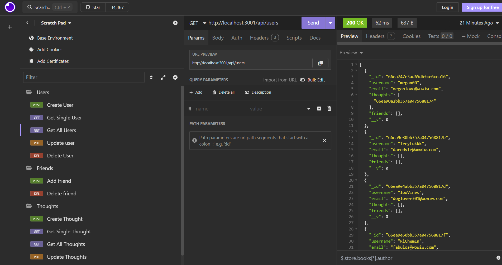
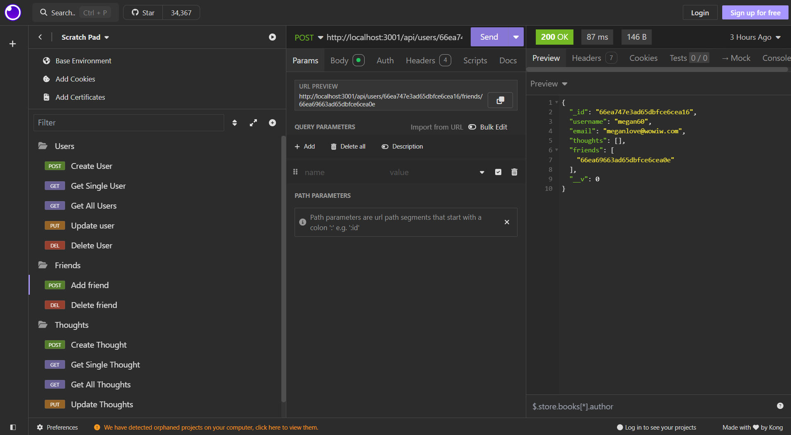
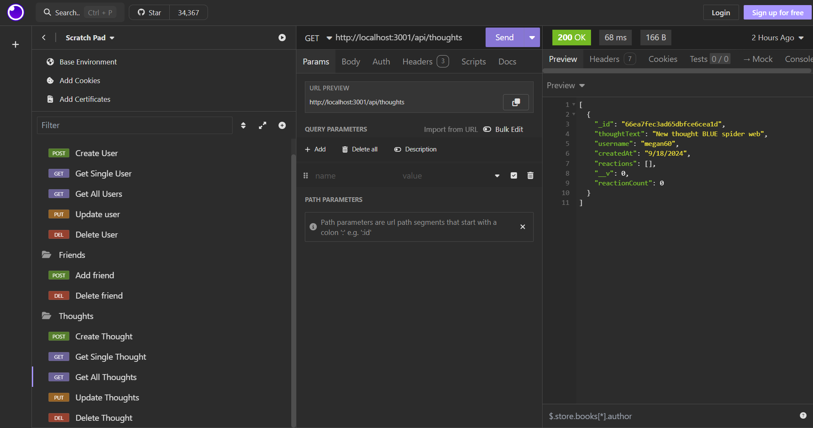

# Network-api

## Description
This Network Api is a backend application using node.js, express, and MongoDB. It lets users create and manage a social network where they share thoughts, add friends, reaction, and create friends list.

## Installation
- Clone the repository
- Install the dependencies
- Start the server using node server.js

## Usage
Uses Insomnia. The API provides routes for managing users, thoughts, friends, and reactions.

## Image

## Walkthrough Video

## License
This project licensed under the MIT license.
